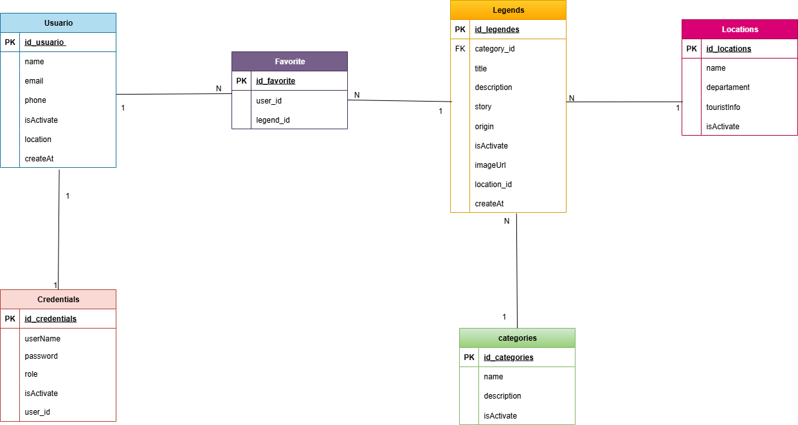
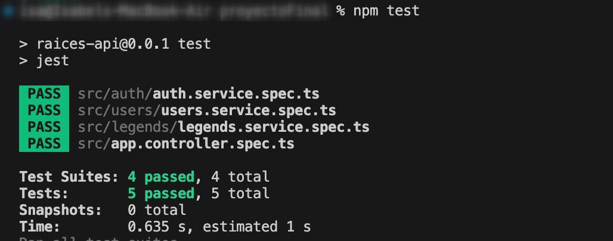

# API Mitos y Leyendas - Raíces Ancestrales


## Descripción
API REST para preservar y difundir mitos, leyendas e historias locales de diferentes regiones de Colombia, promoviendo el turismo cultural. Permite a los usuarios explorar leyendas por categoría, región, y guardar sus favoritas.

## Integrantes
- **Carolina Diaz** - Módulo Users (CRUD usuarios + favoritos)
- **Yuri Rodriguez** - Módulo Credentials (gestión de credenciales y hash de passwords)
- **Isabel Yepes** - Módulo Auth + Guards  + Seed(autenticación, JWT, guards y decorators)
- **Isabel Estrada** - Módulo Legends (CRUD leyendas + filtros y búsquedas)
- **Tatiana Bayona** - Módulo Categories + Locations (CRUD categorías, ubicaciones))

## Modelo Entidad-Relación (MER)



## Tecnologías
- **Backend:** NestJS, TypeORM
- **Base de Datos:** PostgreSQL
- **Autenticación:** JWT (JSON Web Tokens)
- **Documentación:** Swagger
- **Testing:** Jest

## Instalación Local

### Prerrequisitos
- Node.js 18+ 
- PostgreSQL 14+
- npm o yarn

### Pasos de Instalación

1. Clonar el repositorio
```bash
git clone https://github.com/isabelyb/raices
```

2. Instalar dependencias
```bash
npm install
```

3. Configurar PostgreSQL
```bash
psql -U postgres
CREATE DATABASE mitos_db;
\q
```

4. Configurar variables de entorno

Crear archivo `.env.development` en la raíz del proyecto:
```env
DB_HOST=localhost
DB_PORT=5432
DB_USERNAME=postgres
DB_PASSWORD=password
DB_NAME=mitos_db
JWT_SECRET=secret_key_segura
```

5. Iniciar servidor en modo desarrollo
```bash
npm run start:dev
```

6. Cargar datos iniciales

Visitar: `http://localhost:3000/seed`

Esto creará:
- 5 categorías
- 10 ubicaciones
- 18 leyendas
- 1 usuario administrador

### Credenciales de Prueba

**Administrador:**
- Username: `admin`
- Password: `admin123`

## Scripts Disponibles

```bash
npm run start:dev    # Modo desarrollo con hot-reload
npm run start:prod   # Modo producción
npm run test         # Ejecutar pruebas unitarias
```

## Documentación API

Una vez el servidor esté corriendo, acceder a:
- Swagger UI: `http://localhost:3000/api`
- JSON Schema: `http://localhost:3000/api-json`

## Estructura del Proyecto
```
src/
├── auth/           # Autenticación y autorización
├── users/          # Gestión de usuarios
├── credentials/    # Credenciales (username/password)
├── legends/        # CRUD de leyendas
├── categories/     # Categorías de leyendas
├── locations/      # Ubicaciones turísticas
├── seed/           # Datos iniciales
├── entities/       # Entidades TypeORM
├── enums/          # Enumeraciones (roles)
├── config/         # Configuración de TypeORM
└── main.ts         # Entry point
```

## Endpoints Principales

### Públicos (sin autenticación)
- `GET /categories` - Listar categorías
- `GET /locations` - Listar ubicaciones
- `GET /legends` - Listar leyendas
- `GET /legends/legendById/:uuid` - Obtener leyenda por ID
- `GET /locations/:id/legends` - Leyendas por ubicación

### Autenticación
- `POST /auth/signin` - Login (obtener token JWT)
- `POST /auth/signup` - Registro de usuario
- `GET /auth/profile` - Perfil del usuario autenticado

### Protegidos (requieren token + rol ADMIN)
- `POST /legends/createLegend` - Crear leyenda
- `PUT /legends/updateLegends` - Actualizar leyenda
- `DELETE /legends/deleteLegendById/:uuid` - Eliminar leyenda (soft delete)

Para la documentación completa con ejemplos de request/response, consulta:
- [Swagger UI](http://localhost:3000/api)
- [Documentación de endpoints](Docs/ENDPOINTS.md)

## Roles y Permisos

- **USER**: Puede ver leyendas, categorías, ubicaciones y gestionar favoritos
- **ADMIN**: Acceso completo incluyendo crear, editar y eliminar leyendas

## Pruebas Unitarias

### Pruebas Implementadas

Se implementaron **5 pruebas unitarias** básicas usando Jest para validar el funcionamiento de los módulos principales:

1. **AppController** (1 test)
   - Verifica que el endpoint raíz devuelve HTML con el nombre del proyecto

2. **AuthService** (2 tests)
   - Verifica que `signUp()` crea un usuario correctamente
   - Verifica que `signIn()` devuelve un token JWT válido

3. **LegendsService** (1 test)
   - Verifica que `getAllLegendsService()` devuelve un array de leyendas

4. **UsersService** (1 test)
   - Verifica que `findOne()` devuelve un usuario por UUID

### Resultado de la Ejecución

```bash
npm test
```

**Resultado:**

